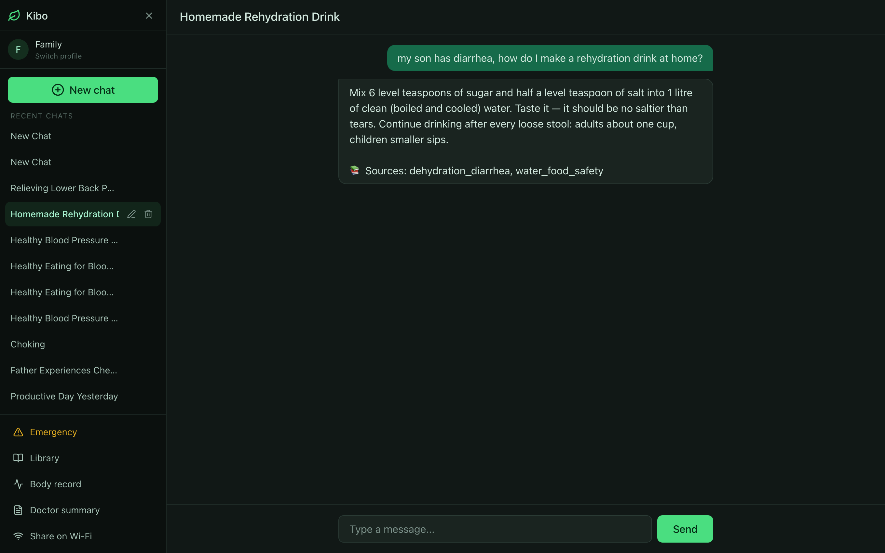
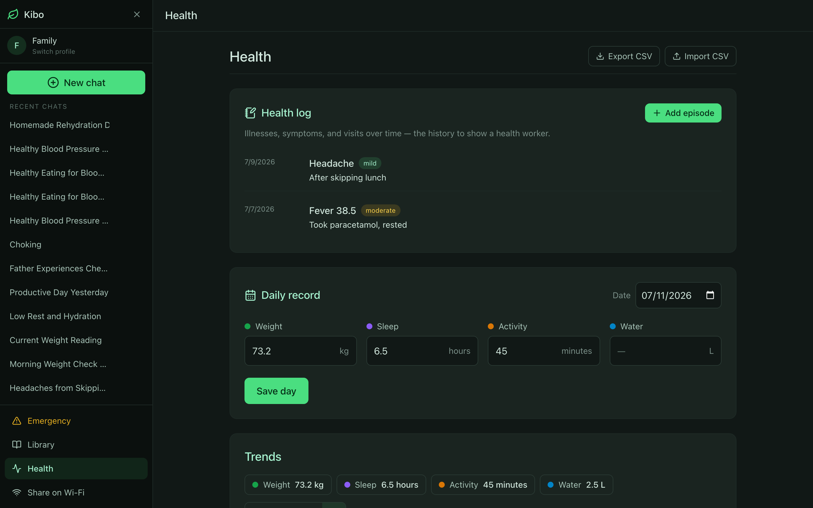
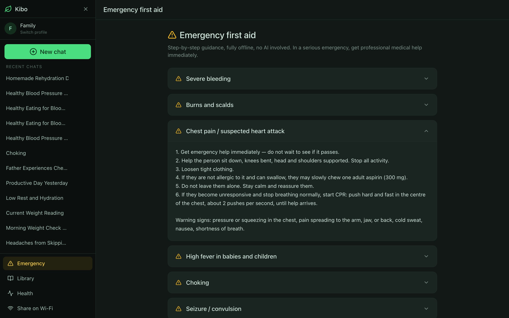
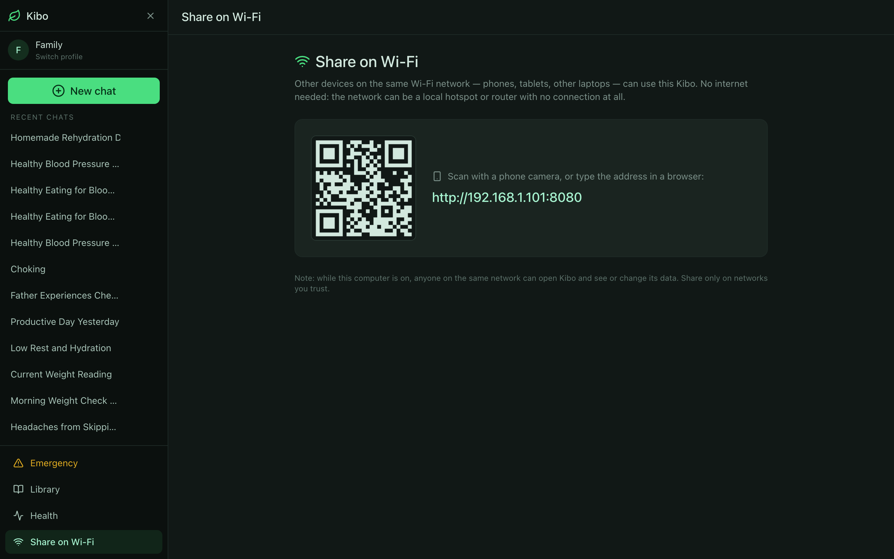
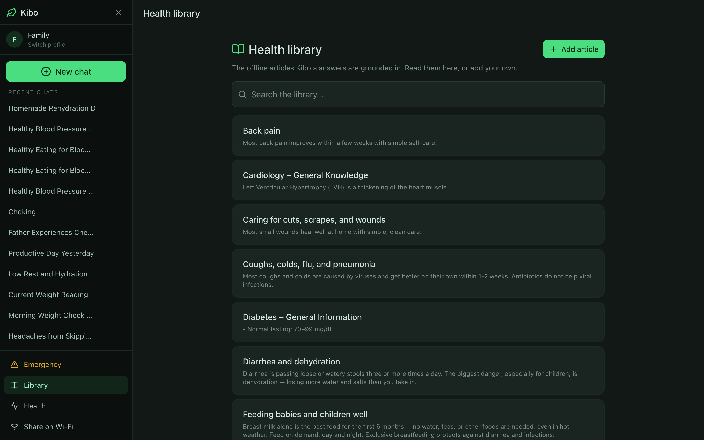
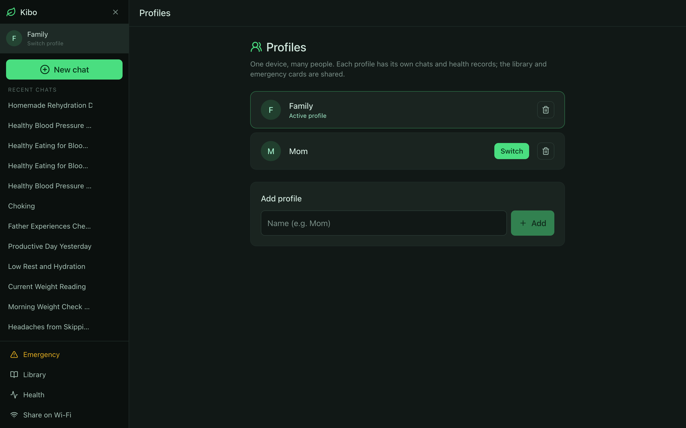

# 🌿 Kibo — offline AI health companion

A fully offline health assistant for low-connectivity, low-power settings. It runs on a modest laptop with no internet: chat grounded in a local medical library, health tracking, instant first-aid cards, and per-person profiles — all from a single binary, with data that never leaves the device.

> ⚠️ Kibo is not a doctor. It's a companion and reference tool; always seek professional care for serious conditions.

## Screenshots

| Grounded answers with sources | Health log, daily records, and trends |
|---|---|
|  |  |

| Instant first-aid cards (no AI) | One laptop serves every phone |
|---|---|
|  |  |

| Browsable, editable health library | A profile for every family member |
|---|---|
|  |  |

## Features

- **Grounded offline chat** — answers draw on a curated local health library (RAG) and cite their sources; passages below a relevance threshold are dropped, so off-topic questions get no fabricated citations.
- **Personal context** — the AI reads your own tracked records and per-chat history, persisted in SQLite so it survives restarts.
- **Emergency mode** — eight first-aid cards embedded in the binary; red-flag chat messages return the matching card in ~13 ms, with no LLM in the path.
- **Health tab** — a health log (symptom/illness/visit history), a daily vitals sheet, trend charts, and a printable one-page doctor summary.
- **Log by chatting** — "yesterday I slept 5 hours" saves a record; confirmations are built from what was actually stored, never from the model.
- **Editable library** — read, search, add, and edit the articles the AI cites; new articles are indexed live.
- **Wi-Fi sharing** — one laptop serves every phone on the local network via a QR code; works on a hotspot with no internet.
- **Family profiles** — separate chats and records per person on one device.
- **Local data, portable** — one SQLite file; CSV export/import with safe deduplication.

## Architecture

One Go binary serves the API and the UI; the only runtime dependency is [Ollama](https://ollama.com).

```
Browser ── React SPA (embedded via go:embed)
   │  same-origin /api
Go server (net/http + gorilla/mux)
   ├── SQLite ........ chats, records, profiles, health log
   ├── chromem-go .... in-process vector store (no external DB)
   └── Ollama ........ llama3.2 (chat) + nomic-embed-text (embeddings)
```

Request flow for a chat message:

```
message
 ├─ emergency keyword match → first-aid card   (deterministic, no LLM)
 ├─ classifier                                  (1 LLM call: intent + service)
 ├─ if health intent → RAG:
 │     retrieve personal records + KB passages  (vector search + threshold)
 │     grounded generation
 │     append citations from the passages actually used
 └─ conversation memory read from SQLite        (per chat, survives restart)
```

Design choices worth noting:

- **Single binary, no Docker.** The React build is embedded with `go:embed`; the vector store runs in-process (chromem-go). `go build` produces one ~14 MB executable.
- **Safety is deterministic.** First-aid cards and record confirmations never pass through the LLM, so it can't paraphrase first-aid steps or claim to have saved data it didn't.
- **Grounding over trust.** Retrieval runs on the raw user message; low-similarity passages are dropped, so answers are either cited from real sources or say they don't have the information.
- **Same-origin API.** The SPA calls `/api` relative, so LAN sharing and profiles work with no per-device configuration.

**Stack:** Go · SQLite · chromem-go · Ollama · React + TypeScript + Vite + Tailwind

## Quick start

Requirements: Go, Node.js (build only), and [Ollama](https://ollama.com). One script handles the rest — checks Ollama, pulls the models if missing, builds, and runs:

```bash
./kibo.sh          # build and run → http://localhost:8080
./kibo.sh dev      # hot-reload dev mode → http://localhost:5173
./kibo.sh build    # build the binary only (backend/kibo)
./kibo.sh stop     # stop anything left running
```

The first run needs internet once (models, npm packages). After that Kibo is fully offline — all data stays in `data/`, and Node is never needed at runtime.

## Roadmap

- [ ] AI-suggested health-log entries from chat (one-tap confirm, never auto-saved)
- [ ] Import from Apple Health (`export.xml`) and Google Takeout
- [ ] Knowledge-base update packs distributable by USB stick
- [ ] Local-language support

## License

All rights reserved. See [LICENSE](LICENSE).
